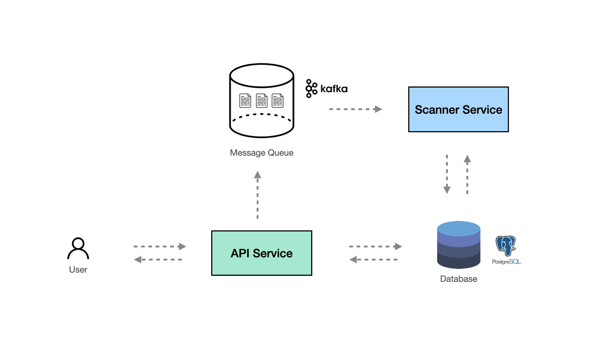

# gh-scanner

gh-scanner is a lightweight web service that provides Github code scan tool to find any potentially sensitive information that may have been accidentally committed and exposed to the public. It's designed to be simple by utilizing a scanner to search for particular keyword in the codebase.

## Overview


## Features
- Scan for potential secets and credentials and store findings in db
- Use message queue as a channel to publish/subscribe message for code scan request
- REST API for CRUD operation on Github repository
- REST API for CRUD operation on scan result


## Components
### 1. API Service
The API service is the web service responsible for exposing REST API to end user, handling all application logcs, configuring and injecting required libraries, and producing Github scan request to message queue to trigger the scanner service to start scanning. 
### 2. Scanner Service
The scanner service is mainly used for code scanning and detecting potential secrets and credentials. It works by asynchonously seaching for a set of particular word defined in the user-provided [scanner rules](/app/worker/rules.go). The scanner service subscribe to a message channel and wait for the request to scan Github repo sent by the API service.


# Getting Started

## Building and Running

### 1. Prerequisite
To run the project, you will need to have Kafka with Zookeper (as a message queue), and Postgresq (as a database) installed and running. Alternatively, you can use below command to build and start container image for these prerequisited services:
```
make start-service
```

Next, you need to run the following comand to setup application:
```
make setup
```
This will setup `.env` and configure docker network used by all gh-scanner containers for you.


### 2. Running gh-scan
In order to start the app, there are two services that need to be run together — API Service and Scanner service. To setup, please run command
```
make start-app
```

Now, you should have 5 containers running (can inspect running docker containers with `docker ps`):
1. broker (kafka)
2. ghs-zookeeper
3. ghs-db (postgres)
4. gh-scanner-api (api service)
5. gh-scanner-worker (scanner service)

 You can now start sending a request to `http://localhost:8080`

This project also includes with [Postman collection](/gh-scanner.postman_collection.json). Please download and import to your machine and set Postman environment variable `gh_scanner_host` to `http://localhost:8080`.


## Unit test
The project comes with unit test to ensure validity of functionalities. In particular, all program use cases have accompanying unit tests for all scenarios in that use case. You can run unit test with command:
```
make test
```
This will trigger all unit tests in the project.


## Development
To run application locally, you need to first install dependencies. At the root of project, run:
```
go mod download
```

Then you need to start start API Service and Scanner worker. To start API service please run:
```
go run cmd/api/main.go
```
Optional parameters:
- `--production`: read and use production environment variables 
-  `--check-migration`: check and run migration automatically if necessary

Then to start Scanner service, open a new terminal and run:
```
go run cmd/worker/main.go
```

### Run migration
If you run app locally for the first time, you may need to run the migration to create all tables with the following command:
```
go run cmd/api/main.go migrate
```

## Project Structures
The project is made easy for maintenance and ease for future changes by implementing clean architecture where the code is organized as a layer with specific responsibility. The layer in this project can be defined from the innermost layer to the outermost layer as follows:
- Presenter (`app/presenters`) : receive imcoming requests and pass to use case, format response sent by use case to end user
- Use cases (`app/usecases`): handle code business logics
- Entities (`app/entities`): define data model used in the app and connect to database

