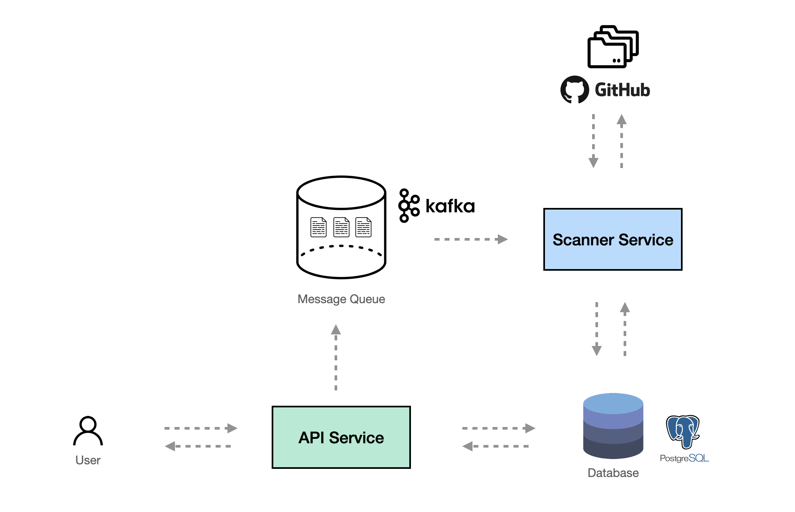

# gh-scanner

gh-scanner is a lightweight web application that provides github analysis service to find any potentially sensitive information that may have been accidentally committed and exposed to the public. It's designed to be simple by utilizing a scanner to search for particular keyword in the codebase.

## Overview

## Features
- REST API for CRUD operation on github repository
- REST API for CRUD operation on scan result
- Trigger a scanner and run in the background
- Receive and publish data via message queue
- User can view the scan result

## How to run
- TODO